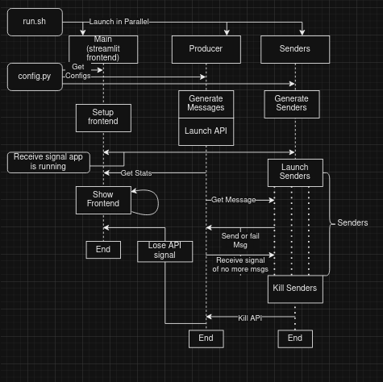

# Introduction
Here, I believe, is one program that should be to the specifications. 
It has a frontend with configurable refresh rate, 
multiple configurable senders, and a producer that generates and distribtues messages. 

I used Async to make multiple senders rather than making the senders individual processes. I believe 
making the senders individual processes would be pretty much the same as what I have, just using `subprocess.Popen`, but
I think this solution has much better behavior overall. 

# How to use
## Running the App
`pip install -r requirements.txt` to get the requirements, then run `run.sh` to 
run the app. `run.sh` will launch `main.py` (streamlit frontend), `producer.py` 
(fastapi backend) and `senders.py` (simulation of multiple senders using async)  
All programs will terminate at the end of the simulation.

### Launch sequence

## Configuration
To modify how things are run, modify `config.yaml` before running. This config file is validated before anything runs.
* `senders : int`: Number of senders
* `sender_rates : List[float]`: list of messages per second sending speed for each sender. If the list is longer than the number of senders, only the first ones are used. If it's shorter, the rest use the last rate.
* `failure_rates : List[float]`: list of probabilities that message fails to send for each generate sender. Same behavior as above
* `total_msgs : int` : total number of messages generated
* `frontend_refresh_time : float` : seconds before frontend refreshes
* `producer_url : str` : Url of fastapi backend

If the config file is deleted, a new config file will be generated with default values. 

Configuration is also validated before running.

Extra functions have been included for modifying the config files for testing the program.

## Unit Tests
Reasonable unit tests are included in `tests.py`, can be run with `pytest tests.py`. 

## Troubleshooting
FastApi can be extremely difficult to terminate. I have included the ability to post `/kill` to its url to terminate it.
# Behind the scenes
An entire day was lost as it is... more difficult than I thought to handle the frontend aspect. 
Flask doesn't seem to be able to self refresh without JQuery. Dash has built-in Interval for self refreshing data but 
was having some hard to trace issues with keeping up with the data. Most other frontends seem to want to be self contained 
processes. I suppose at this point, though, another frontend would work exactly the same as streamlit currently does and I 
could port the logic to PyQt6 or Textualize.